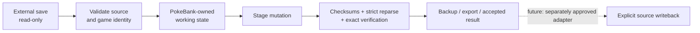

<p align="center">
  
</p>

<h1 align="center">PokeBank NX</h1>

<p align="center">
  <strong>A native, offline Pokémon bank and save-management frontend for CFW Nintendo Switch systems.</strong>
</p>

<p align="center">
  Browse supported saves, inspect Trainers / Party / Boxes / inventory, stage generation-aware Pokémon edits,
  and move toward one safe library for Pokémon across generations.
</p>

<p align="center">
  <a href="LICENSE"></a>
  
  
  
  
</p>

<p align="center">
  <a href="https://github.com/GlitchedZeus/PokeBank-NX/actions/workflows/host-tests.yml"></a>
  <a href="https://github.com/GlitchedZeus/PokeBank-NX/pull/92"></a>
  <a href="https://github.com/GlitchedZeus/PokeBank-NX/pull/92"></a>
</p>

<p align="center">
  <a href="#overview">Overview</a> •
  <a href="#project-status">Status</a> •
  <a href="#features">Features</a> •
  <a href="#supported-games">Games</a> •
  <a href="#save-safety">Safety</a> •
  <a href="#building">Build</a> •
  <a href="#roadmap">Roadmap</a> •
  <a href="#license">License</a>
</p>

---

> [!IMPORTANT]
> **PokeBank NX is pre-release software.** The integrated Gen I–IV staged editor and Product UI foundation is now **hardware accepted** on the exact `0760334f` NRO, following a 100% owner-reported Nintendo Switch test pass and six green CI gates. Touch controls remain in their separate validation lane; the experimental **Quit RetroArch → PokeBank NX** return lifecycle is not part of this accepted startup path.

## Overview

PokeBank NX is a native Nintendo Switch homebrew project focused on one problem: giving Pokémon saves from different generations a single, consistent, controller-first home **without treating the original save as a disposable working file**.

The app is designed around staged editing, explicit source identity, conservative parsing, and hardware acceptance tied to exact builds. The long-term goal is not simply “another save editor”; it is a Switch-native Pokémon management layer with provenance, banks, search, validation, transfer tooling, and source-specific writeback that is only enabled when that path has been individually proven safe.

### Design goals

- **Native Switch UX** — controller-first navigation, readable handheld presentation, themes, fast source/game switching, and a consistent product shell.
- **Generation-aware editing** — expose fields that actually exist in the source format instead of pretending every generation stores modern metadata.
- **Source safety** — external saves remain read-only during ordinary editing; mutations happen in app-owned state.
- **Truthful capability reporting** — unsupported, ambiguous, or incomplete evidence fails closed instead of being guessed.
- **Exact-build validation** — CI is necessary, but hardware acceptance belongs to the exact NRO that was physically tested.

## Project status

| Area | State | Notes |
|---|---|---|
| Switch runtime / native NRO | ✅ Working | C++20 + devkitA64/libnx native build |
| Generation I | ✅ Hardware accepted | R/B/Y read + staged shared editor |
| Generation II | ✅ Hardware accepted | G/S/C read + staged shared editor |
| Generation III | ✅ Hardware accepted | R/S/E/FR/LG read + staged shared editor |
| Generation IV | ✅ Hardware accepted | D/P/Pt/HG/SS staged full-editor foundation and integrated Product UI accepted on exact `0760334f` build; DS direct launch tested |
| Product Home / Games UI | ✅ Hardware accepted | Exact `0760334f` Switch pass: Quick View, source routing, keyboard/numpad, legacy RetroArch launches and native SWSH/SV/Z-A preview/open |
| Audit hardening | ✅ Integrated | Full forensic remediation is integrated into the active application lane: 43 verified, 1 deferred, 0 open |
| Legality analysis | 🔬 Active R&D | Read-only Gen I–IV evidence engine in a separate lane; language-domain work accepted and ball-domain production integration active |
| Touch controls | 🧪 Hardware validation | App-wide direct/native touch parity is implemented in PR #122 with exact-head CI green; device acceptance is still pending |
| Master Vault / named Banks | ⏳ Planned | UI identity exists; persistent backend is intentionally not enabled yet |
| Live source writeback | 🔒 Locked | No global unsafe-write switch |

> [!NOTE]
> All six exact-head Host, Native, Product UI, Gen IV and focused regression workflows passed for the **owner-accepted** PR #92 candidate: application `0760334fb850ca46b5171c55f690998d7680d4e7`, NRO SHA-256 `4f28d7f7ad38c2b62458642e014ae3c05e866755c4152bf4c2db0574c381ce91`. [PR #92](https://github.com/GlitchedZeus/PokeBank-NX/pull/92) records the current device-acceptance boundary; `CURRENT_STATUS.md` retains detailed engineering checkpoints.

## Features

### Product Home

The current frontend is built as a console-style product experience rather than a collection of developer screens.

- selected-game hero presentation;
- profile and trainer context;
- game artwork and region-aware presentation assets;
- six-slot Party preview using the existing Pokémon sprite pipeline;
- consistent **Current save party** presentation for successfully parsed saves;
- larger handheld-friendly names / levels / party spacing;
- real per-save Pokédex progress where supported;
- **Open** and **Launch** actions;
- full-screen six-column Games artwork browser;
- Quick Games drawer with cached/non-blocking selection behavior;
- compact Games / Banks / Items / Search / More navigation;
- top-right profile and Settings ownership;
- remembered focus / cursor state across reconstructed screens;
- shared in-app keyboard and numeric keypad with controller + touch support;
- sorting and Release Date ordering foundation;
- Favorites foundation;
- neutral idle round destinations with blue/cyan focus only;
- themes and controller navigation with D-pad + left-stick parity.

### Games / save assignment

The Games surface now does more than choose a title. It is becoming the game/save/profile assignment front end.

- `X = Save / Source` opens source assignment for the selected game/profile;
- Gen I–III can select another validated matching save instead of being trapped on the first assignment;
- Gen IV uses the provider-neutral source-setup flow;
- full Games tiles remain artwork/game focused rather than duplicating trainer portraits;
- Quick Games retains trainer / Pokédex / Party presentation after selection;
- FireRed / LeafGreen HOME-forwarder launch identity is separated from the real assigned GBA save identity used by preview/open;
- duplicate/ambiguous sources remain explicit instead of being silently guessed;
- sort/favorite state is kept separate from profile identity and save custody.

### Pokémon / save workflows

Across the supported Gen I–IV foundation, PokeBank NX currently provides combinations of:

- Trainer information;
- Party and Boxes;
- inventory / item views;
- Pokémon detail views;
- staged **View / Create / Edit** workflows;
- generation-native move handling;
- compatibility-aware move selection;
- DVs / Stat Exp / IVs / EVs according to the real generation;
- Held Item, Friendship, Pokérus, Ball, Met Location, Language, forms, and origin fields where the source format supports them;
- checksum repair / strict reparse / rollback on supported staged save formats;
- exact-game restrictions instead of broad “close enough” assumptions.

### Generation IV editor

Diamond / Pearl / Platinum / HeartGold / SoulSilver currently have the most active editor work beyond the hardware-accepted Gen I–III base:

- Party + Box View/Edit;
- empty Box Add/Create;
- trainer-bound PK4 creation;
- Held Item / Language / Ball / Pokérus / Met Location;
- native move picker and PP handling;
- species-compatible move filtering;
- Species mutation with dependent-state reconciliation;
- supported Form editing with exact-game restrictions;
- trainer/origin inspection;
- Box/Party action parity;
- checksum refresh, strict full-save reparse, and rollback;
- immutable external emulator source during ordinary editing.

The first safe Gen IV editing milestone and the **integrated Gen IV + Product UI foundation** have now passed hardware testing, most recently on exact build `0760334f`. Nintendo DS direct launch is proven on hardware with Diamond while respecting DraStic's own **Quit to Launcher** behavior. Experimental RetroArch return-to-PokeBank lifecycle work remains separate from the accepted direct-launch path.

## Supported games

| Generation | Games | Read / browse | Staged editor | Device state |
|---|---|:---:|:---:|---|
| I | Red / Blue / Yellow | ✅ | ✅ | **Accepted** |
| II | Gold / Silver / Crystal | ✅ | ✅ | **Accepted** |
| III | Ruby / Sapphire / Emerald / FireRed / LeafGreen | ✅ | ✅ | **Accepted** |
| IV | Diamond / Pearl / Platinum / HeartGold / SoulSilver | ✅ | ✅ | **Integrated foundation accepted (`0760334f`)** |
| V | Black / White / Black 2 / White 2 | ❌ | ❌ | Not started |
| 3DS | X/Y, ORAS, SM/USUM | 🚧 Research/provider groundwork | ❌ | Not supported as a product workflow yet |
| Modern Switch | LGPE, SWSH, BDSP, PLA, SV, Legends Z-A | 🚧 Identity / validation / preview groundwork varies; SWSH/SV/Z-A preview/open tested | ❌ | Preview/open verified for selected titles; full editor not accepted |

PokeBank NX does **not** fabricate modern fields in older formats. A Generation I Pokémon is presented as Generation I data; a Generation IV Pokémon is handled as PK4 data.

## Save sources and launching

The source layer is provider-aware: a save belongs to a game, provider, and source identity instead of being treated as “just a file path.”

Current product work includes:

- RetroArch source discovery;
- DraStic Gen IV sources;
- melonDS Gen IV sources;
- manual / remembered assignments;
- duplicate-source handling and source identity;
- app-owned game/ROM launch bindings;
- exact-release matching to prevent similarly named releases from colliding;
- validated provider/emulator launch routing and installed HOME-forwarder fallback where appropriate;
- bounded direct-ROM discovery instead of blocking full-card scans;
- hotpath work that avoids unnecessary source/launch discovery during Quick Games and normal legacy opens;
- explicit **Link Game File** fallback instead of path guessing.

The hardware-accepted `0760334f` candidate confirms tested Gen I–III RetroArch launch resolution, including Red/Blue, and Nintendo DS direct launch without the earlier freeze/normal ROM-chooser dead end. The accepted RetroArch launch path uses **direct core handoff**; the experimental bundled **PokeBank Return Host** was bypassed after device regressions and is preserved only for future, separately validated return-lifecycle work.

> [!WARNING]
> A save path is **not** proof of a ROM path. PokeBank NX does not guess a launch target from a similarly named save file, and launch permission never grants save-write permission.

## Save safety

The save-safety contract is intentionally boring — and that is the point.



### Permanent guardrails

- ✅ Original external saves remain immutable during ordinary editing.
- ✅ Emulator-source writes remain disabled.
- ✅ Installed-title live writes remain disabled.
- ✅ Unknown or ambiguous sources fail closed.
- ✅ App-owned staged editing is allowed.
- ✅ Destructive operations require explicit intent.
- ✅ Launch capability and write capability are separate permissions.
- ❌ No global unsafe-write toggle.
- ❌ Source injection is not enabled as a side effect of editor work.
- ❌ Cross-game True Move is not broadly enabled.

The intended future transaction model is:

**fingerprint → backup → stage → validate → explicit write → readback → recovery/rollback**

Every source adapter must earn write permission independently.

## Read-only legality engine

A separate development lane is building an evidence-aware legality engine for Gen I–IV. It is intentionally **analysis only** today.

The implemented foundation now covers far more than simple species/move bounds. Current work includes:

- exact source-game profiles and generation ceilings;
- exact-game move compatibility;
- Gen I/II encounter, trade and history evidence;
- substantial Gen III event, PID/IV and RNG evidence;
- Pokémon Colosseum / XD / e-Reader / GameCube-specific evidence;
- Gen III → IV Pal Park transfer evidence;
- Gen IV wild/static/trade/PokéWalker/WC4/PCD/form/origin/RNG evidence;
- state-aware Gen IV static/gift egg provenance work;
- Method J/K lead-predicate and reroll/history evidence under isolated validation;
- accepted Gen III/IV language-domain enforcement for exact sources;
- source-backed Gen III/IV Ball-ID domain evidence, with production analyzer integration advancing in an isolated child PR;
- coverage-aware report semantics.

The report model distinguishes between:

- **Invalid** — available source-backed evidence proves a contradiction;
- **No problems found** — the checks that actually ran found no contradiction;
- **Incomplete** — the engine does not yet have enough evidence to make a stronger statement.

> [!CAUTION]
> The legality engine does not auto-fix Pokémon, does not grant source-write permission, and does not claim parity with external legality tools until equivalent evidence and regression coverage exist. Unknown, unsupported, unreconstructable history and bounded-search exhaustion remain **Incomplete**.

## Engineering quality

The project is tested as native software, not just as UI code.

Current development gates include:

- host regression suites;
- ASan + UBSan sanitizer runs;
- source-mutation / custody contracts;
- generated-data validation;
- PNG / presentation-asset validation;
- clean devkitA64 compile + link;
- native Product UI NRO packaging;
- Gen IV candidate validation;
- focused generation/editor regression suites;
- touch-input gating and exact-head touch validation;
- physical Switch acceptance of exact candidate artifacts.

A repository-wide forensic audit and remediation pass is complete. The remediation package was integrated into the active PR #92 application lane on **2026-10-05** while the frozen forensic evidence checkpoint remains preserved. Final remediation disposition is **43 verified/fixed, 1 deferred with justification, 0 open**.

<details>
<summary><strong>Engineering lanes and checkpoints</strong></summary>

| Lane | Purpose / state |
|---|---|
| [PR #92](https://github.com/GlitchedZeus/PokeBank-NX/pull/92) | **Hardware-accepted MAIN checkpoint:** Gen I–IV staged editor and integrated Product UI on exact `0760334f`; open/draft, not merged |
| [PR #122](https://github.com/GlitchedZeus/PokeBank-NX/pull/122) | **Active touch lane:** app-wide direct/native touch parity is near completion; separate open/draft PR, physical acceptance and integration still pending |
| [PR #103](https://github.com/GlitchedZeus/PokeBank-NX/pull/103) | **Active legality lane:** read-only Gen I–IV engine progressing independently; product integration tentatively planned after Gen IX |
| [PR #149](https://github.com/GlitchedZeus/PokeBank-NX/pull/149) | **Active legality child:** Gen III/IV Ball-ID domain production integration against the accepted legality head |
| [PR #101](https://github.com/GlitchedZeus/PokeBank-NX/pull/101) | **Merged checkpoint:** completed forensic-audit remediation, integrated into PR #92 on 2026-10-05 |

GitHub is authoritative. Old handoff documents and historical branch SHAs are evidence, not instructions to move active branches backward.

</details>

## Building

PokeBank NX targets Nintendo Switch homebrew using **C++20**, **devkitPro / devkitA64 / libnx**, **SDL2** for platform/window/input support, and **NanoVG/OpenGL** for the current renderer.

### Requirements

- devkitPro;
- devkitA64;
- libnx;
- GNU Make;
- a CFW Nintendo Switch / homebrew environment for device testing.

The Makefile requires `DEVKITPRO` to be set in the environment.

```bash
git clone https://github.com/GlitchedZeus/PokeBank-NX.git
cd PokeBank-NX
make
```

The native target is `PokeBankNX.nro`.

> [!NOTE]
> There is no v1.0 release yet. For development/hardware candidates, GitHub Actions is the reproducible build path used by the project. Hardware acceptance is tied to the exact application commit and exact built NRO, not merely to a nearby green commit.

## Installation

For a locally built/development NRO:

1. Create a folder such as `sdmc:/switch/PokeBank-NX/`.
2. Copy `PokeBankNX.nro` into that folder.
3. Launch it from the Switch homebrew menu.
4. Keep your real saves backed up and treat development builds as development builds.

PokeBank NX does not provide commercial game ROMs or console firmware.

## Repository layout

| Path | Purpose |
|---|---|
| `src/` | Application, UI, save, Pokémon, conversion, legality and integration code |
| `include/` | Public/internal interfaces and shared models |
| `romfs/` | Runtime presentation/data assets packaged into the NRO |
| `assets/` | Application metadata/icon resources |
| `tests/` | Host regression and safety-contract tests |
| `tools/` | Data generation, asset preparation and maintenance utilities |
| `.github/workflows/` | Host, sanitizer and native Switch CI |
| `docs/` | Engineering status, support matrices, architecture and roadmap documentation |

## Roadmap

Near-term development order:

1. **Preserve the hardware-accepted Gen I–IV + Product UI checkpoint** (`0760334f`, `DEVICE_ACCEPTED=true`) as the working baseline; PR #92 remains unmerged until explicitly approved.
2. Finish and physically validate **app-wide touch controls** in PR #122; integrate forward only after its own exact-build acceptance and explicit approval.
3. Complete any remaining Product UI polish and independently validate the deferred RetroArch return-to-PokeBank lifecycle without regressing the accepted direct launch path.
4. Expand provider support and staged editing in hardware-tested steps through **Gen V, VI, VII, VIII and IX**, with exact-game validation and unchanged live-save write locks.
5. Continue the **read-only legality engine** in parallel; defer product integration until after Gen IX, subject to evidence coverage and regression testing.
6. Build **Master Vault + named Banks**, provenance, search and collection features as separately authorized milestones.
7. Introduce source-specific write transactions only after backup, validation, readback and recovery are proven and each adapter is explicitly approved.
8. Release hardening → **v1.0**.

The forensic remediation integration is complete. The legality engine and touch lane can continue advancing in parallel because neither weakens the save-safety boundary or grants live source-write permission.

## Bug reports

Useful hardware reports include:

- PokeBank NX version / build SHA;
- exact NRO hash when available;
- Switch mode (handheld/docked);
- game and generation;
- source/provider (RetroArch, DraStic, melonDS, manual, etc.);
- exact steps to reproduce;
- screenshots or video when the issue is visual.

Please avoid posting personal/private save files publicly. Use a disposable test save when a reproduction requires writable or sensitive data.

## Project documentation

The README is intentionally product-facing. Exact engineering state lives in:

- [CURRENT_STATUS.md](CURRENT_STATUS.md) — live branch/head/CI/hardware boundary;
- [PROJECT_STATUS.md](PROJECT_STATUS.md) — project-level milestone summary;
- [Game Support Matrix](docs/GAME_SUPPORT_MATRIX.md) — generation/game support and device state;
- [v1.0 Roadmap](docs/V1_ROADMAP.md) — checked/unchecked milestone plan;
- [UI Ownership Status](docs/UI_OWNERSHIP_STATUS.md) — UI ownership and migration notes.

## License

PokeBank NX is licensed under the **GNU Affero General Public License v3.0 (AGPL-3.0)**.

> [!NOTE]
> The complete license terms are in [LICENSE](LICENSE). The README is not a substitute for the license text.

Third-party code, data, research, artwork sources, and reference projects retain their own licenses and attribution requirements.

## Disclaimer

PokeBank NX is an unofficial fan-made homebrew project and is not affiliated with or endorsed by Nintendo, The Pokémon Company, GAME FREAK, or Creatures Inc.

Pokémon and related trademarks and game assets are property of their respective owners.