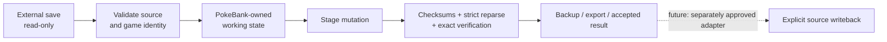

<p align="center">
  
</p>

<h1 align="center">PokeBank NX</h1>

<p align="center">
  <strong>A native, offline Pokémon bank and save-management frontend for CFW Nintendo Switch systems.</strong>
</p>

<p align="center">
  Browse supported saves, inspect Trainers / Party / Boxes / inventory, stage generation-aware Pokémon edits,
  and move toward one safe library for Pokémon across generations.
</p>

<p align="center">
  <a href="LICENSE"></a>
  
  
  
  
</p>

<p align="center">
  <a href="https://github.com/GlitchedZeus/PokeBank-NX/actions/workflows/host-tests.yml"></a>
  <a href="https://github.com/GlitchedZeus/PokeBank-NX/actions/workflows/product-ui-native.yml"></a>
  <a href="https://github.com/GlitchedZeus/PokeBank-NX/actions/workflows/gen4-shared-editor-candidate.yml"></a>
</p>

<p align="center">
  <a href="#overview">Overview</a> •
  <a href="#project-status">Status</a> •
  <a href="#features">Features</a> •
  <a href="#supported-games">Games</a> •
  <a href="#save-safety">Safety</a> •
  <a href="#building">Build</a> •
  <a href="#roadmap">Roadmap</a> •
  <a href="#license">License</a>
</p>

---

> [!IMPORTANT]
> **PokeBank NX is pre-release software.** Gen I–III workflows are hardware accepted. The current Gen IV + Product UI development head is automated-green, but the latest integrated UI remains under physical Switch validation and should not be treated as a finished release build.

## Overview

PokeBank NX is a native Nintendo Switch homebrew project focused on one problem: giving Pokémon saves from different generations a single, consistent, controller-first home **without treating the original save as a disposable working file**.

The app is designed around staged editing, explicit source identity, conservative parsing, and hardware acceptance tied to exact builds. The long-term goal is not simply “another save editor”; it is a Switch-native Pokémon management layer with provenance, banks, search, validation, transfer tooling, and source-specific writeback that is only enabled when that path has been individually proven safe.

### Design goals

- **Native Switch UX** — controller-first navigation, readable handheld presentation, themes, fast source/game switching, and a consistent product shell.
- **Generation-aware editing** — expose fields that actually exist in the source format instead of pretending every generation stores modern metadata.
- **Source safety** — external saves remain read-only during ordinary editing; mutations happen in app-owned state.
- **Truthful capability reporting** — unsupported, ambiguous, or incomplete evidence fails closed instead of being guessed.
- **Exact-build validation** — CI is necessary, but hardware acceptance belongs to the exact NRO that was physically tested.

## Project status

| Area | State | Notes |
|---|---|---|
| Switch runtime / native NRO | ✅ Working | devkitA64 + libnx native build |
| Generation I | ✅ Hardware accepted | R/B/Y read + staged shared editor |
| Generation II | ✅ Hardware accepted | G/S/C read + staged shared editor |
| Generation III | ✅ Hardware accepted | R/S/E/FR/LG read + staged shared editor |
| Generation IV | 🧪 Hardware validation | D/P/Pt/HG/SS staged full-editor foundation implemented |
| Product Home / frontend | 🎨 Final polish | Current integrated head is automated-green; device acceptance still required |
| Legality analysis | 🔬 Active R&D | Read-only Gen I–IV evidence engine in a separate development lane |
| Touch controls | ⏳ Planned | Starts after the integrated UI candidate is physically accepted |
| Master Vault / named Banks | ⏳ Planned | UI identity exists; persistent backend is intentionally not enabled yet |
| Live source writeback | 🔒 Locked | No global unsafe-write switch |

> [!NOTE]
> The current active Gen IV/Product UI development head passes Host Tests, the native Product UI build, and the Gen IV candidate gate. The current legality-engine development head also passes its exact-head Host Tests. Neither fact replaces physical hardware acceptance for the final application candidate.

## Features

### Product Home

The current frontend is built as a console-style product experience rather than a collection of developer screens.

- selected-game hero presentation;
- profile and trainer context;
- game artwork and region-aware presentation assets;
- six-slot Party preview using the existing Pokémon sprite pipeline;
- larger handheld-friendly names / levels / party spacing;
- real per-save Pokédex progress where supported;
- **Open** and **Launch** actions;
- full-screen Games artwork browser;
- quick-games drawer;
- compact Games / Banks / Items / Search / More navigation;
- top-right profile and Settings ownership;
- remembered focus / cursor state across reconstructed screens;
- themes and controller navigation with D-pad + left stick parity.

### Pokémon / save workflows

Across the supported Gen I–IV foundation, PokeBank NX currently provides combinations of:

- Trainer information;
- Party and Boxes;
- inventory / item views;
- Pokémon detail views;
- staged **View / Create / Edit** workflows;
- generation-native move handling;
- compatibility-aware move selection;
- DVs / Stat Exp / IVs / EVs according to the real generation;
- Held Item, Friendship, Pokérus, Ball, Met Location, Language, forms, and origin fields where the source format supports them;
- checksum repair / strict reparse / rollback on supported staged save formats;
- exact-game restrictions instead of broad “close enough” assumptions.

### Generation IV editor

Diamond / Pearl / Platinum / HeartGold / SoulSilver currently have the most active development work beyond the hardware-accepted Gen I–III base:

- Party + Box View/Edit;
- empty Box Add/Create;
- trainer-bound PK4 creation;
- Held Item / Language / Ball / Pokérus / Met Location;
- native move picker and PP handling;
- species-compatible move filtering;
- Species mutation with dependent-state reconciliation;
- supported Form editing with exact-game restrictions;
- trainer/origin inspection;
- Box/Party action parity;
- checksum refresh, strict full-save reparse, and rollback;
- immutable external emulator source during ordinary editing.

The first safe Gen IV editing milestone has already passed hardware testing. The **current full Gen IV + Product UI combination remains hardware-pending while the frontend receives its finishing touches**.

## Supported games

| Generation | Games | Read / browse | Staged editor | Device state |
|---|---|:---:|:---:|---|
| I | Red / Blue / Yellow | ✅ | ✅ | **Accepted** |
| II | Gold / Silver / Crystal | ✅ | ✅ | **Accepted** |
| III | Ruby / Sapphire / Emerald / FireRed / LeafGreen | ✅ | ✅ | **Accepted** |
| IV | Diamond / Pearl / Platinum / HeartGold / SoulSilver | ✅ | ✅ | **Current integrated candidate pending** |
| V | Black / White / Black 2 / White 2 | ❌ | ❌ | Not started |
| 3DS | X/Y, ORAS, SM/USUM | 🚧 Research/provider groundwork | ❌ | Not supported as a product workflow yet |
| Modern Switch | LGPE, SWSH, BDSP, PLA, SV, Legends Z-A | 🚧 Identity / validation groundwork varies | ❌ | Not generally accepted |

PokeBank NX does **not** fabricate modern fields in older formats. A Generation I Pokémon is presented as Generation I data; a Generation IV Pokémon is handled as PK4 data.

## Save sources and launching

The source layer is provider-aware: a save belongs to a game, provider, and source identity instead of being treated as “just a file path.”

Current product work includes:

- RetroArch source discovery;
- DraStic Gen IV sources;
- melonDS Gen IV sources;
- manual / remembered assignments;
- duplicate-source handling and source identity;
- app-owned game/ROM launch bindings;
- direct launch when the emulator/content target is proven;
- explicit **Link Game File** fallback when it is not.

> [!WARNING]
> A save path is **not** proof of a ROM path. PokeBank NX does not guess a launch target from a similarly named save file, and launch permission never grants save-write permission.

## Save safety

The save-safety contract is intentionally boring — and that is the point.



### Permanent guardrails

- ✅ Original external saves remain immutable during ordinary editing.
- ✅ Emulator-source writes remain disabled.
- ✅ Installed-title live writes remain disabled.
- ✅ Unknown or ambiguous sources fail closed.
- ✅ App-owned staged editing is allowed.
- ✅ Destructive operations require explicit intent.
- ✅ Launch capability and write capability are separate permissions.
- ❌ No global unsafe-write toggle.
- ❌ Source injection is not enabled as a side effect of editor work.
- ❌ Cross-game True Move is not broadly enabled.

The intended future transaction model is:

**fingerprint → backup → stage → validate → explicit write → readback → recovery/rollback**

Every source adapter must earn write permission independently.

## Read-only legality engine

A separate development lane is building an evidence-aware legality engine for Gen I–IV. It is intentionally **analysis only** today.

Current work includes exact source-game profiles, generation/game ceilings, move compatibility, encounter/event evidence, transfer history, Gen III/IV PID/RNG families, Gen IV form/origin checks, and coverage-aware reporting.

The report model distinguishes between:

- **Invalid** — available evidence proves a contradiction;
- **No problems found** — the checks that actually ran found no contradiction;
- **Incomplete** — the engine does not yet have enough evidence to make a stronger statement.

> [!CAUTION]
> The legality engine does not auto-fix Pokémon, does not grant source-write permission, and does not claim parity with external legality tools until equivalent evidence and regression coverage exist.

## Engineering quality

The project is tested as native software, not just as UI code.

Current development gates include:

- host regression suites;
- ASan + UBSan sanitizer runs;
- source-mutation / custody contracts;
- generated-data validation;
- PNG / presentation-asset validation;
- clean devkitA64 compile + link;
- native Product UI NRO packaging;
- focused generation/editor regression suites;
- physical Switch acceptance of exact candidate artifacts.

A repository-wide forensic audit and remediation pass has also been completed in a separate lane. That hardening work covers parser boundaries, memory safety, durability, backup/custody behavior, source-mutation policy, regression coverage, and native build confidence without enabling unsafe write paths.

<details>
<summary><strong>Active engineering lanes</strong></summary>

| Lane | Purpose |
|---|---|
| [PR #92](https://github.com/GlitchedZeus/PokeBank-NX/pull/92) | Current Gen I–IV application, Gen IV full editor, Product UI and hardware-fix work |
| [PR #103](https://github.com/GlitchedZeus/PokeBank-NX/pull/103) | Read-only Gen I–IV legality engine research / implementation |
| [PR #101](https://github.com/GlitchedZeus/PokeBank-NX/pull/101) | Completed forensic-audit remediation package awaiting owner-approved integration |

GitHub is authoritative. Old handoff documents and historical branch SHAs are evidence, not instructions to move active branches backward.

</details>

## Building

PokeBank NX targets Nintendo Switch homebrew using **devkitPro / devkitA64 / libnx**.

### Requirements

- devkitPro;
- devkitA64;
- libnx;
- GNU Make;
- a CFW Nintendo Switch / homebrew environment for device testing.

The Makefile requires `DEVKITPRO` to be set in the environment.

```bash
git clone https://github.com/GlitchedZeus/PokeBank-NX.git
cd PokeBank-NX
make
```

The native target is `PokeBankNX.nro`.

> [!NOTE]
> There is no v1.0 release yet. For development/hardware candidates, GitHub Actions is the reproducible build path used by the project. Hardware acceptance is tied to the exact application commit and exact built NRO, not merely to a nearby green commit.

## Installation

For a locally built/development NRO:

1. Create a folder such as `sdmc:/switch/PokeBank-NX/`.
2. Copy `PokeBankNX.nro` into that folder.
3. Launch it from the Switch homebrew menu.
4. Keep your real saves backed up and treat development builds as development builds.

PokeBank NX does not provide commercial game ROMs or console firmware.

## Repository layout

| Path | Purpose |
|---|---|
| `src/` | Application, UI, save, Pokémon, conversion and integration code |
| `include/` | Public/internal interfaces and shared models |
| `romfs/` | Runtime presentation/data assets packaged into the NRO |
| `assets/` | Application metadata/icon resources |
| `tests/` | Host regression and safety-contract tests |
| `tools/` | Data generation, asset preparation and maintenance utilities |
| `.github/workflows/` | Host, sanitizer and native Switch CI |
| `docs/` | Engineering status, support matrices, architecture and roadmap documentation |

## Roadmap

Near-term development order:

1. **Finish Product UI / Games UI polish** and close the current hardware-visible regressions.
2. Produce one exact, fully green **Gen I–IV + Product UI** hardware candidate.
3. Physically accept that exact NRO on Switch.
4. Integrate the completed audit-remediation package into the main application lane.
5. Add **full app-wide touch-control parity**.
6. Build **Master Vault + named Banks** with provenance and durable records.
7. Expand provider support and later-generation save coverage.
8. Grow legality / provenance / search / collection tooling into product-facing workflows.
9. Introduce source-specific write transactions only after backup, validation, readback and recovery are proven.
10. Release hardening → **v1.0**.

The legality engine can continue advancing in parallel because it is read-only and does not weaken the save-safety boundary.

## Bug reports

Useful hardware reports include:

- PokeBank NX version / build SHA;
- exact NRO hash when available;
- Switch mode (handheld/docked);
- game and generation;
- source/provider (RetroArch, DraStic, melonDS, manual, etc.);
- exact steps to reproduce;
- screenshots or video when the issue is visual.

Please avoid posting personal/private save files publicly. Use a disposable or sanitized test save when a reproduction fixture is necessary.

## Project documentation

- [Current engineering status](CURRENT_STATUS.md)
- [Project status](PROJECT_STATUS.md)
- [Game support matrix](docs/GAME_SUPPORT_MATRIX.md)
- [v1.0 roadmap](docs/V1_ROADMAP.md)
- [UI ownership/status](docs/UI_OWNERSHIP_STATUS.md)

The README is intentionally product-facing. Exact branch checkpoints, CI run IDs, audit evidence, and handoff details belong in the engineering documents and pull requests.

## License

PokeBank NX is licensed under the **GNU Affero General Public License v3.0**.

See [LICENSE](LICENSE) for the complete license text.

```text
PokeBank NX
Copyright (C) PokeBank NX contributors

This program is free software: you can redistribute it and/or modify it
under the terms of the GNU Affero General Public License as published by
the Free Software Foundation, either version 3 of the License, or
(at your option) any later version.
```

Third-party code, data, research, and reference projects retain their own licenses and attribution requirements.

## Acknowledgements

Pokémon save research is the result of years of work across the wider community. PokeBank NX builds on that ecosystem while keeping its own runtime, safety boundaries, tests, and product decisions explicit.

Thanks to the developers, researchers, testers, emulator authors, homebrew projects, and preservation communities whose public work makes format validation possible.

## Disclaimer

PokeBank NX is an unofficial, fan-made homebrew project. It is not affiliated with, sponsored by, or endorsed by Nintendo, The Pokémon Company, GAME FREAK, or Creatures Inc.

Pokémon, game names, characters, artwork, and related trademarks are property of their respective owners.
